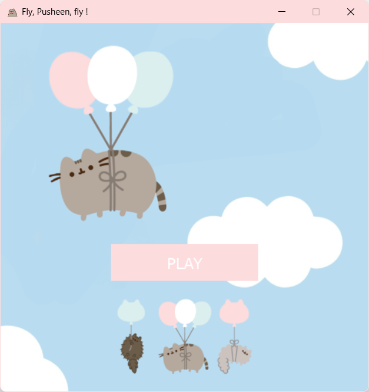
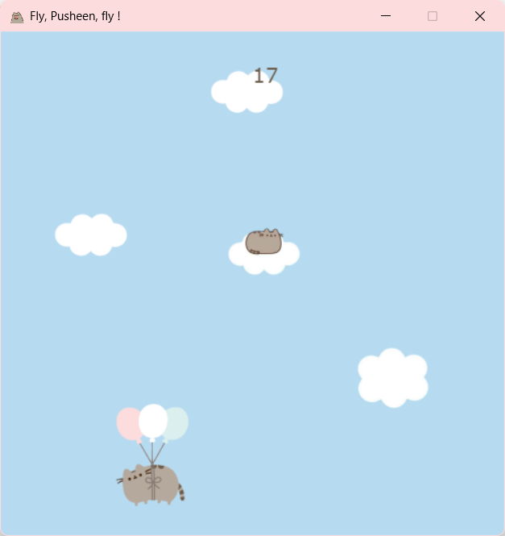
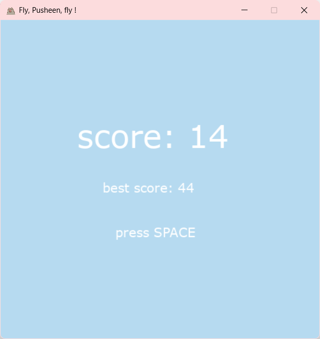

# 🐱 Fly, Pusheen, Fly!

Аркадная игра, разработанная на Python с использованием библиотеки Pygame.

🎈 Помогите кошке Пушин подняться как можно выше и избежать столкновения с облаками!

Игрок управляет котиком, летящим на воздушном шарике. Во время полёта необходимо уклоняться от препятствий и набирать очки. По мере прохождения скорость игры увеличивается, делая её всё сложнее.

---

## 🎮 Возможности игры

* 🐱 Выбор одного из трёх игровых персонажей;
* ☁️ Случайная генерация облаков-препятствий;
* 😺 Появление особого облака с котиком;
* 📈 Постепенное увеличение сложности игры;
* 🏆 Сохранение лучшего результата между запусками;
* 🔊 Звуковые эффекты и фоновая музыка;
* 🖥 Возможность запуска как через Python, так и в виде готового Windows-приложения.

---

## 🕹 Управление

| Клавиша | Действие                               |
| ------- | -------------------------------------- |
| ←       | Движение влево                         |
| →       | Движение вправо                        |
| SPACE   | Возврат в главное меню после проигрыша |

---

## 📸 Скриншоты

### Главное меню



### Игровой процесс



### Экран проигрыша



---

## 🛠 Используемые технологии

* Python;
* Pygame;
* PyInstaller.

---

## 🚀 Запуск проекта

### Установка зависимостей

```bash
pip install -r requirements.txt
```

### Запуск игры

```bash
python fly_pusheen_fly.py
```

---

## 📦 Сборка приложения

Для создания исполняемого файла используется PyInstaller.

Конфигурация сборки хранится в файле:

```text
fly_pusheen_fly.spec
```

Сборка выполняется командой:

```bash
pyinstaller fly_pusheen_fly.spec
```

Готовая версия игры для Windows находится в папке:

```text
release/
```

---

## 📂 Структура проекта

```text
fly-pusheen-fly/

├── data/                # изображения и звуковые файлы
├── game_screenshots/    # скриншоты игры
├── release/             # готовая Windows-версия
│
├── fly_pusheen_fly.py
├── fly_pusheen_fly.spec
├── requirements.txt
├── .gitignore
└── README.md
```

---

## 📌 О проекте

Игра разработана в качестве итогового проекта по программе дополнительного образования **«Разработка компьютерных игр на языке Python»** (144 академических часа).

В ходе разработки были реализованы:

* обработка пользовательского ввода;
* система игровых состояний;
* генерация случайных препятствий;
* постепенное увеличение сложности игры;
* сохранение лучшего результата;
* работа с графикой, анимацией и звуковым сопровождением;
* сборка готового приложения для Windows.
